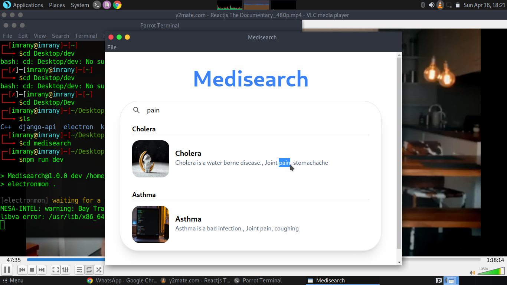

# Desktop-app
It run with tailwindcss

```bash
npx tailwindcss -i ./render/input.css -o ./render/output.css --watch
```
# Demo 
[](./assets/demo_video/video.mp4)


## Video

<video muted markdown="0" controls>
  <source src="./assets/demo_video/video.mp4" type="video/mp4" markdown="0">
</video>


## License

[CC0 1.0 (Public Domain)](LICENSE.md)
